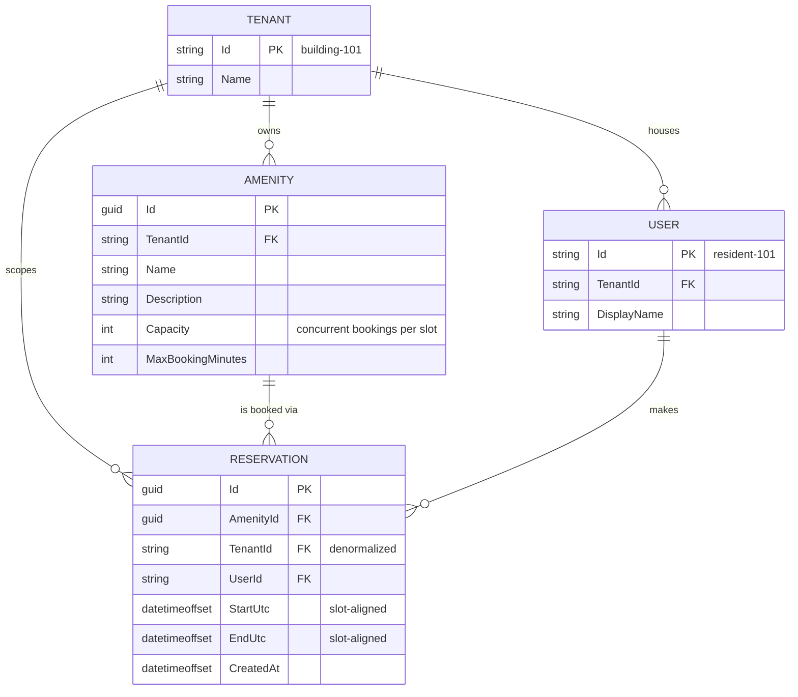

# Amenity Reservations — Design

A thin, running slice of amenity booking for a multi-tenant property-management platform.
Backend is .NET 9 minimal API over an in-memory store; frontend is React + TypeScript talking
through an orval-generated client.

---

## 1. Assumptions & Trade-offs

### Assumptions

| # | Assumption | Why |
| --- | --- | --- |
| A1 | **Auth is mocked via headers.** `X-Tenant-Id` and `X-User-Id` identify the building and the resident. | No identity provider in the scaffold. See the honesty note below. |
| A2 | **Time is discretized into 30-minute slots.** Bookings start and end on `:00`/`:30` boundaries. | Makes the capacity check exact rather than conservative (§3). 30 rather than 60 minutes so the seeded gym's `MaxBookingMinutes = 90` stays expressible. |
| A3 | **All times are UTC**, carried as `DateTimeOffset`. | A booking system that stores naive local times eventually books the wrong hour. Display-time-zone conversion is a UI concern. |
| A4 | **A reservation belongs to exactly one amenity** and cannot span amenities. | Matches the domain. |
| A5 | **Cancel is a hard delete.** | Keeps cancelled rows from accidentally blocking new bookings. Trade-off below. |
| A6 | **An amenity belongs to exactly one tenant.** | No amenities shared across buildings in a portfolio. |

> **Honesty note on A1.** `X-Tenant-Id` is **client-controlled and provides no security whatsoever.**
> Any caller can set it to another building and read that building's data. It exists so the UI can
> demonstrate isolation, not to enforce it. §4 describes what actually enforcing it looks like; the
> code shape there is identical, which is what makes it a clean swap — and is also precisely why the
> header version is worth nothing on its own.

### Trade-offs taken

- **Hard delete over soft delete (A5).** A `Status = Cancelled` column is better for audit and for
  "why did my booking disappear", but it introduces a failure mode: every capacity query must
  remember `WHERE status <> 'cancelled'`, and the one that forgets silently blocks legitimate
  bookings against phantom rows. For a slice, deletion is the safer default. Production wants the
  status column plus an audit trail — and a test asserting cancelled bookings free their slot.
- **Per-amenity lock over a lock-free scheme.** See §3.
- **In-memory store, no ORM.** The brief calls for it explicitly. §4's persistence design is written
  up but deliberately not built.

### Questions I'd ask a PM

1. **Can a resident hold multiple concurrent bookings for the *same* amenity?** I assumed no (one
   active booking per resident per amenity) because that's the common fairness rule, but it's a
   policy decision — and whether "active" means *not yet ended* or *not yet started* changes the
   check.
2. **What are opening hours, and do they vary by amenity and by day?** Guest parking is plausibly
   24/7 while the party room is not. Drives whether hours live on the amenity or in a schedule table.
3. **Is there a cancellation cutoff?** Cancelling a party room 10 minutes ahead is very different
   from 10 days ahead, and a cutoff implies a fee or penalty concept.
4. **Do building managers get override powers** — book on a resident's behalf, cancel anyone's
   booking, block an amenity for maintenance? The simulated-user dropdown includes a Manager, but
   this slice grants them no special permissions.
5. **What does capacity actually mean per amenity?** Gym capacity 2 could mean "2 people" or "2
   reservations, each possibly a household". Affects whether we need a party-size field.

### Explicitly out of scope

| Cut | Why |
| --- | --- |
| Opening hours / blackout dates | Pure validation surface. Adds schema and UI without exercising the concurrency crux, which is what this exercise grades hardest. |
| Recurring bookings | Materially harder (expansion, exceptions, "edit this or all future"). Its own project. |
| Payments, deposits, fees | Separate subsystem with its own failure modes. |
| Real persistence (EF Core + Postgres) | The brief says not to. Designed in §4, not built. |
| Notifications / reminders | No delivery infrastructure in the scaffold. |
| Manager override permissions | Needs a role model; the dropdown's Manager is currently just a third resident. |
| Waitlists | Only meaningful once capacity is reliably enforced. |

---

## 2. Data Model



### Key constraints

- `StartUtc` and `EndUtc` align to 30-minute boundaries; `EndUtc > StartUtc`.
- `EndUtc - StartUtc <= Amenity.MaxBookingMinutes`.
- For every 30-minute slot a reservation covers, the count of reservations covering that slot must
  not exceed `Amenity.Capacity`.
- At most one **active** reservation per `(AmenityId, UserId)`, where *active* means `EndUtc > now`.
  (A resident whose booking has already ended may book again; one whose booking is upcoming or in
  progress may not. This is the interpretation I picked for PM question 1 — it is a guess, not a
  requirement.)

`USER` and `TENANT` appear in the diagram as logical entities but are **not materialized in this
slice** — users and tenants are opaque string identifiers arriving in headers, with no rows behind
them. They are drawn because the relationships and foreign keys are real once persistence exists.

### Seed data

Two buildings, so isolation is demonstrable rather than asserted:

| Tenant | Amenities |
| --- | --- |
| `building-101` | Party Room (cap 1, max 240m), Gym (cap 2, max 90m), Guest Parking (cap 1, max 1440m) |
| `building-202` | Rooftop Terrace (cap 4, max 120m), Pool (cap 3, max 60m) |

### Why `TenantId` is denormalized onto `Reservation`

A reservation's tenant is derivable — follow `AmenityId` to the amenity and read its tenant. Storing
it again is textbook denormalization, and in a store with no foreign keys the two values can drift.

I'm doing it anyway, for one reason: **authorization shouldn't require a join.** `DELETE
/api/reservations/{id}` must establish that the caller's tenant owns that row. With the column
present that's a direct comparison. Without it, every such endpoint has to remember to join through
the amenity first — and a join you can forget is a security surface, whereas a column you can't
forget is not. It's also a hard prerequisite for §4: Postgres row-level-security policies and
tenant-leading indexes both need `tenant_id` on the table itself.

The consistency risk is handled by never accepting `TenantId` from the client. It is always written
from the resolved tenant context, and the amenity is looked up within that same tenant, so the two
cannot disagree by construction.

---

## 3. Concurrency: Preventing Double-Booking

**This is the crux.**

### The failure mode

Two residents request the gym for 09:00–10:00 at the same instant.

```
Thread A                              Thread B
--------                              --------
read reservations for gym             read reservations for gym
count covering 09:00 slot = 1         count covering 09:00 slot = 1
1 < capacity(2)  -> OK                1 < capacity(2)  -> OK
                                      append reservation      <-- count is now 2
append reservation                    <-- count is now 3, capacity is 2
```

A **time-of-check-to-time-of-use (TOCTOU) race.** The check and the write are separate steps, and any
correctness rule enforced by reading first is defeated by an interleaving write. Kestrel serves
requests on thread-pool threads, so this is reachable in the scaffold as written — not theoretical.

### Getting the check itself right

Before choosing a mechanism, the check has to be correct — and the obvious formulation is not.

The natural rule — *count existing bookings overlapping the requested window; reject if the count has
reached capacity* — is **wrong for `Capacity > 1`**. Gym, capacity 2:

```
Existing A:  09:00 ──────── 10:00
Existing B:                 10:00 ──────── 11:00
Request  C:        09:30 ────────── 10:30
```

C overlaps A, and C overlaps B, so the count is 2 and C is rejected. But occupancy never exceeds 2:
09:30–10:00 holds `{A, C}`, and 10:00–10:30 holds `{B, C}`. **C is legal and we refused it.**

The flaw: bookings that overlap *the request* need not overlap *each other*, so a flat count
overestimates peak concurrency. It fails safe — over-rejects, never under-rejects — but it makes a
half-empty gym report itself full.

**Slot alignment (A2) repairs this.** Evaluate capacity per 30-minute slot rather than per request:

```
for each 30-minute slot S covered by [StartUtc, EndUtc):
    n = count of existing reservations for this amenity covering S
    if n >= amenity.Capacity: reject 409
```

Within a single slot, every covering reservation is concurrent for that slot's full duration, so the
count *is* the peak concurrency. The check becomes exact. This is the main reason the slot model is
worth its loss of flexibility.

### Chosen mechanism (this slice): amenity-keyed lock

```csharp
private readonly ConcurrentDictionary<Guid, object> _amenityGates = new();

var gate = _amenityGates.GetOrAdd(amenityId, _ => new object());
lock (gate)
{
    // read, validate, capacity-check, and insert — one atomic step
}
```

`ConcurrentDictionary<Guid, Reservation>` holds the reservations; the lock is what makes
check-and-insert atomic, which is the part that actually prevents the race. A thread-safe collection
alone would not — it makes each individual operation safe while leaving the *sequence* interleavable,
which is exactly the bug.

**Keyed per amenity, not global**, because conflicts only ever exist within one amenity. That's the
true contention domain, so booking the gym shouldn't serialize behind someone booking guest parking.

Two properties this buys for free:

- **Multi-slot bookings are all-or-nothing.** Holding the lock across the whole check-and-insert
  means a 3-slot booking takes all three or none; no partial write is observable.
- **Cancellation takes the same lock**, so a delete can't interleave with a create's scan and produce
  a stale count.

**Limitation, stated plainly: the lock is per-process.** Run two API instances behind a load balancer
and it protects nothing — each process has its own dictionary. That isn't a flaw in the choice; it's
the reason the production answer below is a database constraint rather than a bigger lock.

### Rejected alternative: optimistic concurrency with retry

Keep a version counter per amenity, run the capacity check, write conditional on the version being
unchanged, retry on conflict. It's the right tool when contention is low and you must cross process
boundaries without holding a lock.

**Rejected here** because it is strictly more machinery — a version column, a compare-and-swap, a
retry loop, a retry budget — in exchange for a benefit that doesn't exist in this context: not
holding a lock during the write. The write appends to an in-memory dictionary; it takes nanoseconds.
Paying for lock-free semantics to protect a nanosecond is the wrong trade, and every one of those
moving parts is a place for a bug that this time box gives me no room to find.

### Production mechanism: let the database refuse

At scale the guarantee shouldn't depend on application code at all. Materialize booked slots and let
a unique index do the work:

```sql
CREATE TABLE reservation_slots (
    reservation_id uuid NOT NULL REFERENCES reservations(id) ON DELETE CASCADE,
    amenity_id     uuid NOT NULL,
    slot_start     timestamptz NOT NULL,
    seat_index     int  NOT NULL,          -- 0 .. capacity-1
    tenant_id      text NOT NULL,
    UNIQUE (amenity_id, slot_start, seat_index)
);
```

A booking inserts one row per covered slot, claiming the lowest free `seat_index`. The
(capacity + 1)-th concurrent booking violates the unique constraint and the transaction aborts. The
database enforces the invariant across any number of application instances, with no distributed
coordination.

**A note on Redis/Redlock.** Distributed locks are a poor fit for *correctness* specifically —
process pauses and clock drift can leave two holders each believing they hold the lock, so the mutual
exclusion you're relying on isn't guaranteed. Redis is worth adding to *reduce contention* (fail fast
before touching the database), but it shouldn't be the thing standing between you and an
overbooking. The unique constraint is simpler, cheaper, and actually sound.

---

## 4. Multi-Tenancy & Data Isolation

The question isn't *which entities carry `TenantId`* — it's **where the check lives.** A design where
each handler writes its own `.Where(x => x.TenantId == ctx.TenantId)` leaks the first time someone
forgets one, and nothing about the code makes that omission visible in review.

### This slice: scoped accessors

Middleware resolves `X-Tenant-Id` into a scoped `TenantContext`. The store exposes **only pre-scoped
accessors** — handlers never receive the raw collections:

```csharp
app.MapGet("/api/amenities", (InMemoryStore store, TenantContext ctx) =>
    Results.Ok(store.AmenitiesFor(ctx)));
```

There is no unscoped `store.Amenities` for a handler to reach for. Forgetting the filter isn't a
mistake you can make, because the API surface doesn't offer it. That's the property worth having, and
it's the same property the layers below provide at larger scale.

### Layer 1 — application: EF Core global query filters

```csharp
protected override void OnModelCreating(ModelBuilder builder)
{
    builder.Entity<Reservation>().HasQueryFilter(r => r.TenantId == CurrentTenantId);
    builder.Entity<Amenity>().HasQueryFilter(a => a.TenantId == CurrentTenantId);
}
```

`CurrentTenantId` is a scoped property on `TenantDbContext`, populated by the same middleware. Every
LINQ query against these entities is filtered automatically.

**Its limit:** it's a convenience, not a boundary. `IgnoreQueryFilters()`, raw SQL, and `FromSqlRaw`
bypass it entirely. It prevents accidents; it doesn't stop anything determined.

### Layer 2 — infrastructure: PostgreSQL row-level security

```sql
ALTER TABLE reservations ENABLE ROW LEVEL SECURITY;

CREATE POLICY tenant_isolation_policy ON reservations
    FOR ALL
    USING (tenant_id = current_setting('app.current_tenant_id'));
```

> Note: `tenant_id` is `text` here (`"building-101"`), so the policy compares directly. Casting to
> `uuid` would throw on these identifiers — the tenant id type and the policy must agree.

A `DbConnectionInterceptor` sets the session variable inside the transaction before any query runs:

```csharp
public override InterceptionResult<DbTransaction> TransactionStarting(...)
{
    using var cmd = connection.CreateCommand();
    cmd.CommandText = "SET LOCAL app.current_tenant_id = @tenantId";
    // ... bind and execute
}
```

`SET LOCAL` scopes the setting to the transaction, so a pooled connection can't leak one request's
tenant into the next — the critical detail, and the easiest one to get wrong.

**The separation that matters:** the query filter is *application-level*, shipping with the app; RLS
is *database-level* and holds even if the application is compromised, misconfigured, or bypassed by
an ad-hoc `psql` session. Defense in depth means the outer layer catches developer error and the
inner layer catches everything else. Neither substitutes for the other.

### Layer 3 — service user separation

| Role | Grants | Used by |
| --- | --- | --- |
| `app_tenant_user` | Normal DML; **subject to RLS** | The API. Every request-path query. |
| `app_admin_worker` | `BYPASSRLS` | Reporting, ETL, cross-tenant analytics, migrations. |

Reporting genuinely needs to read across tenants, and the wrong way to allow it is to weaken the
policy. Instead the capability lives in a *separate database role* the API never connects as. The
blast radius of an application-layer compromise is then bounded by RLS, because the credentials the
application holds cannot bypass it.

### Isolation models by tier

- **Shared database, RLS-enforced** (above) — the default. Best density, simplest operations.
- **Schema or database per tenant** — for enterprise customers with contractual or regulatory
  isolation requirements. Stronger blast-radius guarantees, materially higher migration and
  operational cost.
- **Dedicated instance per tenant** — reserved for customers whose compliance regime demands physical
  separation, and priced accordingly.

Choosing per tier rather than globally keeps the common case cheap without blocking the deals that
need more.

---

## 5. API Surface

All reservation endpoints require `X-Tenant-Id`; mutating endpoints also require `X-User-Id`. Both
are injected automatically by the frontend's generated-client mutator.

| Method | Path | Body | Success | Errors |
| --- | --- | --- | --- | --- |
| `GET` | `/api/amenities` | — | `200 Amenity[]` | — |
| `GET` | `/api/amenities/{amenityId}/reservations` | — | `200 Reservation[]` | `404` unknown amenity in tenant |
| `POST` | `/api/amenities/{amenityId}/reservations` | `{ startUtc, endUtc }` | `201 Reservation` | `400`, `404`, `409` |
| `DELETE` | `/api/reservations/{id}` | — | `204` | `403` not owner, `404` |

**`POST` request**

```json
{ "startUtc": "2026-09-01T14:00:00Z", "endUtc": "2026-09-01T15:00:00Z" }
```

- **`409 Conflict`** — capacity for at least one covered slot is exhausted.
- **`400 Bad Request`** — misaligned to a 30-minute boundary, non-positive duration, exceeds
  `MaxBookingMinutes`, or the resident already holds an active booking for this amenity.

Errors return RFC 7807 `ProblemDetails` so the UI can distinguish causes without string-matching.

### 403 vs 404 — the distinction is deliberate

| Situation | Status | Why |
| --- | --- | --- |
| Resource belongs to **another tenant** | `404` | A `403` confirms the row exists. Existence is itself tenant-leaking information, so cross-tenant access must be indistinguishable from "no such thing". |
| Resource in **my tenant**, owned by another resident | `403` | Existence is already legitimately visible — the reservation list for an amenity shows co-residents' bookings. Hiding it here would only confuse. |

Cross-tenant checks therefore run *before* ownership checks, never after.

### Why identity is a header, not a body field

`UserId` in the request body would let any caller claim to be any resident. Carrying it in a header
alongside the tenant keeps identity on the same path it takes in production — a verified `sub` claim
on a bearer token — so swapping the mock for real auth touches the middleware and nothing else. It is
*equally insecure today*; it is differently shaped, and the shape is the point.

### Service layer returns results, not status codes

`ReservationService.TryCreateReservation` returns a result carrying a `ReservationError` enum; the
endpoint maps it to HTTP. Status codes are a transport concern, and a service that returns them can't
be reused by a background job, a gRPC surface, or a test without dragging ASP.NET along.

---

## 6. Verification

- **Manual concurrency check.** Fire N simultaneous `POST`s at the same slot on a capacity-2 amenity
  and assert exactly 2 succeed. This is the only claim in the document that can't be confirmed by
  reading the code, so it's the one worth exercising.
- **The over-rejection case from §3** — bookings `09:00–10:00`, `10:00–11:00`, then `09:30–10:30` on
  a capacity-2 amenity — should **succeed**. It's the regression test for the naive capacity rule.
- **Tenant isolation** — request `building-202`'s amenity while sending `X-Tenant-Id: building-101`
  and expect `404`, not `403`. Leaking existence is itself a leak.
- **Cancellation frees capacity** — book to capacity, cancel one, rebook.

Automated tests are the first roadmap item; within the time box these were run by hand.

---

## 7. Next Steps (another 4 hours)

1. **Integration tests, concurrency first.** A `WebApplicationFactory` suite whose headline test
   fires parallel bookings at one slot and asserts capacity holds. The lock is the load-bearing claim
   in this design and it is currently backed by argument rather than evidence. Plus the
   over-rejection and tenant-isolation cases from §6.
2. **Persistence with the constraint that makes the lock unnecessary.** EF Core + Postgres, the
   `reservation_slots` unique index from §3, RLS policies and the connection interceptor from §4.
   This moves the guarantee from per-process to correct-under-horizontal-scaling, and it *retires*
   the lock rather than distributing it.
3. **Booking rules as data, not conditionals.** Opening hours, cancellation cutoffs, and per-resident
   quotas are all policy that doesn't exist yet and that will otherwise accrete as `if` statements
   inside the create path. Moving them behind a small rules abstraction before there are three of
   them is much cheaper than after.
