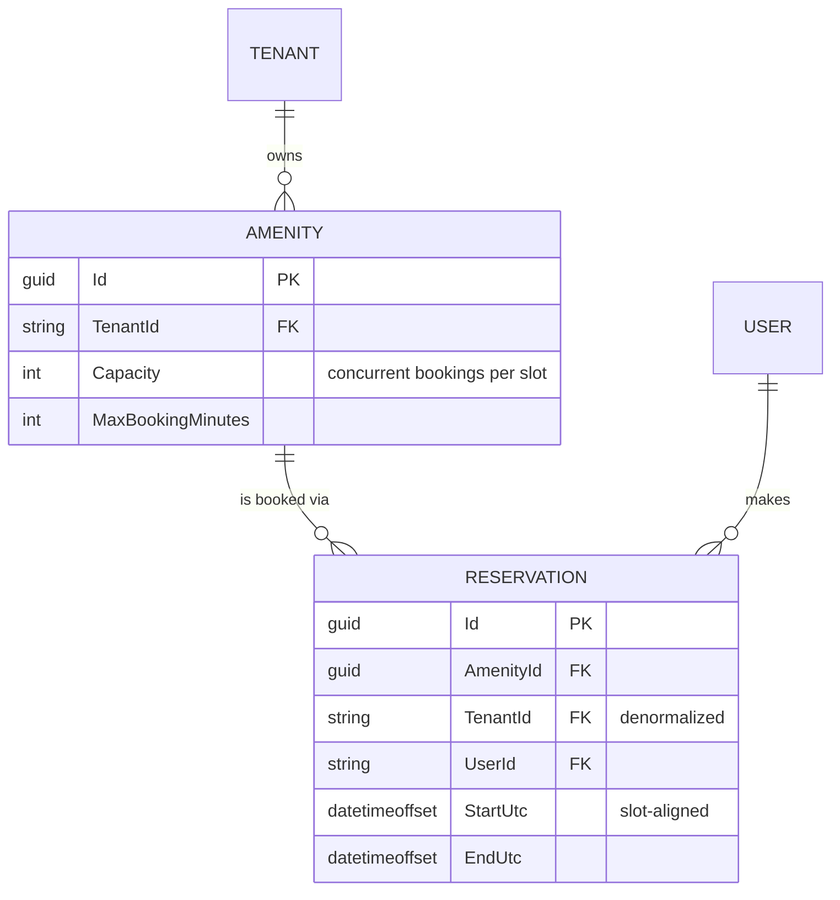

# Amenity Reservations — Design

**Built** — per-slot capacity with an amenity-keyed lock, validation, cancellation, tenant-scoped
endpoints, and a React screen with an availability grid and building/user switchers. 27 tests.
**Designed only** — EF Core + Postgres RLS (§4), and the production concurrency mechanism (§3).
**Not built** — real authentication.

---

## 1. Assumptions, and what I cut

| # | Assumption | Why |
| --- | --- | --- |
| A1 | Auth is mocked: `X-Tenant-Id` / `X-User-Id` headers. | No identity provider in the scaffold. |
| A2 | Time is discretized into **30-minute slots**. | Makes the capacity check exact (§3). 30 not 60, so the gym's 90-minute max stays expressible. |
| A3 | All times UTC, displayed as UTC. | Naive local times book the wrong hour; a local grid misaligns slots in `:45`-offset zones. |
| A4 | "Active" means `EndUtc > now`. | Needed to make one-booking-per-resident enforceable. A guess, not a requirement. |
| A5 | Cancel is a hard delete. | A `Cancelled` status means every capacity query must exclude it; the one that forgets silently blocks real bookings. |

> `X-Tenant-Id` is **client-controlled and carries no security whatsoever** — anyone can set it and
> read another building's data. It demonstrates isolation; §4 is what enforcing it looks like.

**Questions for a PM.** Can a resident hold two bookings for the same amenity, and does "active" mean
not-yet-ended or not-yet-started? Are opening hours per amenity and per day? Is there a cancellation
cutoff, and does it imply a fee? Do managers get overrides — book for a resident, cancel anyone's,
block for maintenance?

**Deliberately out of scope**, in the order I'd add them back: opening hours (validation only, no new
mechanism), recurring bookings (expansion and exceptions — its own project), manager overrides (needs
a role model), then payments, notifications and waitlists.

---

## 2. Data model



`TENANT` and `USER` are logical only — opaque ids from headers, no rows behind them yet.

**Constraints.** Start/end align to 30-minute boundaries; `End > Start`; `Start >= now`; duration
`<= MaxBookingMinutes`; per covered slot, covering reservations `<= Capacity`; at most one active
reservation per `(AmenityId, UserId)`.

**`TenantId` is denormalized onto `Reservation`** though derivable via `AmenityId`, because
**authorization shouldn't need a join**: `DELETE /api/reservations/{id}` must prove the caller's
tenant owns the row, and a join you can forget is a security surface where a column you can't forget
isn't. RLS (§4) also needs it on the table.

---

## 3. Preventing double-booking

Two problems hide here. They're independent, and both need solving:

| | Problem | Symptom if unsolved |
| --- | --- | --- |
| **A** | **What to count** — is the capacity rule correct? | A legal request is refused, with no concurrency involved |
| **B** | **When to count** — are check and write atomic? | Concurrent requests each see room, and overbook |

A is a logic bug; B is a race. Fixing one does nothing for the other.

### Problem A — what to count

The natural rule — *count bookings overlapping this request, reject at capacity* — is **wrong
whenever capacity > 1**. Gym, capacity 2:

```
existing    09:00 ──────── 10:00
existing                   10:00 ──────── 11:00
requested         09:30 ────────── 10:30       overlaps both → count 2 → REFUSED
```

Occupancy never exceeds 2: from 09:30–10:00 the room holds two, from 10:00–10:30 it holds two. The
request is legal and we refused it. Bookings overlapping *the request* need not overlap *each other*,
so a flat count overestimates peak concurrency.

**Fix: count per 30-minute slot.** Within a slot, every booking covering it is concurrent throughout,
so the count *is* peak concurrency and the check is exact. This is the main reason time is
discretized.

### Problem B — when to count: the race

Two residents request the gym for 09:00–10:00 at the same instant. Both read the list, both see room,
both append. Capacity 2 now holds 3 — a **TOCTOU race**: check and write are separate steps, so any
rule enforced by reading first loses to an interleaving write. Kestrel serves on thread-pool threads,
so this is reachable, not theoretical.

Both traces below: gym at capacity 2, residents **A, B and C all POST `09:00–10:00` simultaneously**.

### Solving B in the prototype — an amenity-keyed lock

```
validation (alignment, past, length)     outside the gate; all three pass
gate = _amenityGates.GetOrAdd(gymId)     same object for all three

lock(gate)  A   slots 09:00,09:30 hold 0  →  0 < 2  →  INSERT  →  release
lock(gate)  B   slots 09:00,09:30 hold 1  →  1 < 2  →  INSERT  →  release
lock(gate)  C   slots 09:00,09:30 hold 2  →  2 ≥ 2  →  409, no write
```

B and C block at the gate while A holds it, so neither can read a count a pending write is about to
invalidate. **Correctness comes from serializing check-and-write** — which is also the limit: it
holds only while every writer is in one process.

Two details easy to get wrong: the amenity is validated *before* the gate is created (else anyone
grows the dictionary by posting random GUIDs), and the duplicate-resident check sits *inside* the
lock — it reads like validation, but races identically.

**Why it doesn't survive production.** The lock is per-process, and `lock` can't hold across an
`await` — so adding a database doesn't *extend* this mechanism, it **deletes** it. Scaffolding, not
step one.

### Solving B in production — the database refuses the write

Materialize each slot a booking occupies as a row, with
`UNIQUE (amenity_id, slot_start, seat_index)`, `seat_index ∈ 0..capacity-1`:

```
Same three requests, now across three API instances. No shared lock exists.

A  BEGIN  lowest free seat = 0
          INSERT (gym, 09:00, seat 0), (gym, 09:30, seat 0)   COMMIT   201
B  BEGIN  lowest free seat = 1
          INSERT (gym, 09:00, seat 1), (gym, 09:30, seat 1)   COMMIT   201
C  BEGIN  read was stale — also computed seat 1
          INSERT (gym, 09:00, seat 1)  →  UNIQUE VIOLATION    ROLLBACK 409
```

**The key difference: C's read being wrong doesn't matter.** Correctness no longer depends on reading
fresh state, because the *write* is what gets checked — so it holds across any number of instances
with no coordination. The transaction also makes multi-slot bookings all-or-nothing.

**Rejected alternative: optimistic concurrency with retry.** A version counter, compare-and-swap and
a retry budget is more machinery in exchange for not holding a lock during a write that takes
nanoseconds. The right tool for low contention across processes — but the constraint above gets the
same guarantee with nothing to tune.

---

## 4. Multi-tenancy

**The rule.** Every amenity and reservation carries a `TenantId`, every read and write is scoped to
the caller's building, and `TenantId` always comes from the request context — never the client.

**The design question is where that scoping is enforced.** Per-handler
`.Where(x => x.TenantId == ...)` holds only as long as nobody forgets one, and a missing filter looks
identical to correct code in review.

**In this slice**, two mechanisms a handler can't opt out of: `TenantContext` binds from
`X-Tenant-Id` via a `BindAsync` hook returning null when the header is missing, so ASP.NET rejects
with `400` *before the handler runs*; and the store exposes **only** scoped accessors. No unscoped
`store.Amenities` exists, so forgetting the filter isn't a mistake that's available to make.

**In production, three layers**, each catching what the one above misses:

| Layer | Mechanism | Catches | Limit |
| --- | --- | --- | --- |
| Application | EF Core global query filters | Developer error; every LINQ query filtered | `IgnoreQueryFilters()` and raw SQL bypass it |
| Database | Postgres RLS + `SET LOCAL app.current_tenant_id` via a connection interceptor | Everything above it misses — holds against a compromised app | Needs `tenant_id` on the table (§2) |
| Credentials | `app_tenant_user` (under RLS) for the API; `app_admin_worker` (`BYPASSRLS`) for reporting | Reporting's cross-tenant need without weakening the policy | — |

Not redundant: the filter prevents accidents, RLS *is* the boundary, and the role split means the
API's own credentials can't bypass RLS even if the app is owned. `SET LOCAL` scopes to the
transaction, so a pooled connection can't leak one tenant into the next request.

**403 vs 404.** Another building's resource returns **404**, never 403 — a 403 confirms the row
exists, and existence is tenant-leaking. Another resident's booking *in your own building* returns
**403**, since the list already shows co-residents. Tenancy is checked first.

---

## 5. API surface

All endpoints require `X-Tenant-Id`; mutations also use `X-User-Id`. Identity is a header rather than
a body field so it takes the path a verified token claim will — equally insecure today, but the shape
keeps the swap contained.

| Method | Path | Body | Success | Errors |
| --- | --- | --- | --- | --- |
| `GET` | `/api/amenities` | — | `200 Amenity[]` | `400` |
| `GET` | `/api/amenities/{amenityId}/reservations` | — | `200 Reservation[]` | `404` |
| `POST` | `/api/amenities/{amenityId}/reservations` | `{ startUtc, endUtc }` | `201 Reservation` | `400`, `404`, `409` |
| `DELETE` | `/api/reservations/{id}` | — | `204` | `403`, `404` |

`409` = a covered slot is at capacity. `400` = misaligned, inverted, past, over-length, or the
resident already holds an active booking. Errors are RFC 7807 with a machine-readable `code`, so the
UI branches on the reason rather than the message. The service returns a result enum and the endpoint
maps it — status codes are a transport concern.

---

## 6. Verification

Both problems in §3 were **observed failing before being fixed**: the naive capacity rule refused the
legal `09:30–10:30` booking, and before the lock, 8 threads rushing one slot on a capacity-2 amenity
*all* succeeded. That concurrency test initially passed without the lock and only failed reliably
once repeated 500× — details in the PR description.

**Known gap:** `frontend/src/slots.ts` reimplements the occupancy rule to draw the grid and has no
tests. A drifted client can only mis-*draw*, never overbook — but the failure is silent.
