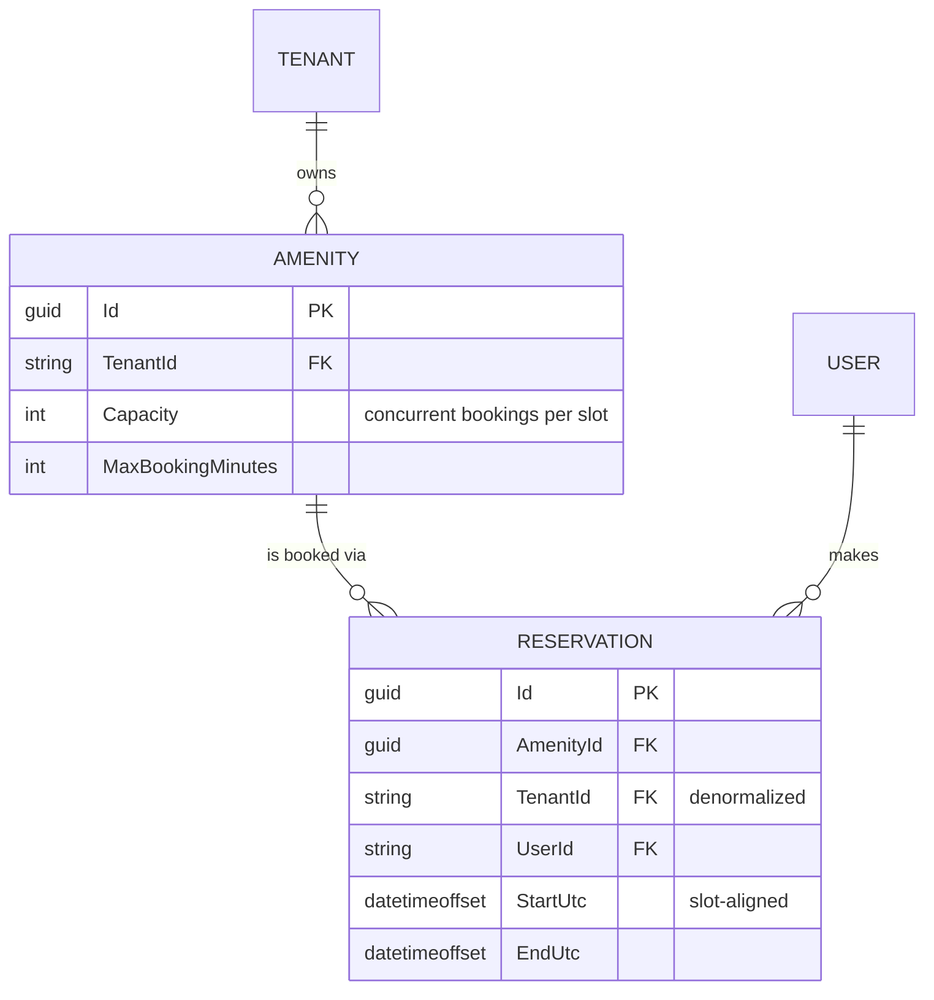

# Amenity Reservations — Design

A running slice: .NET 9 minimal API over an in-memory store, React + TypeScript through the
orval-generated client.

**Built** — per-slot capacity with an amenity-keyed lock, validation, cancellation, tenant-scoped
endpoints, and a screen with an availability grid plus building/user switchers. 27 tests.
**Designed only** — EF Core + Postgres RLS (§4) and the production concurrency mechanism (§3).
**Not built** — real authentication.

---

## 1. Assumptions, and what I cut

| # | Assumption | Why |
| --- | --- | --- |
| A1 | Auth is mocked: `X-Tenant-Id` / `X-User-Id` headers. | No identity provider in the scaffold. |
| A2 | Time is discretized into **30-minute slots**. | Makes the capacity check exact (§3). 30 not 60, so the gym's seeded 90-minute max stays expressible. |
| A3 | All times UTC, displayed as UTC. | Naive local times eventually book the wrong hour; a local grid misaligns 30-minute boundaries in `:45`-offset zones. |
| A4 | "Active" means `EndUtc > now`. | Needed to make the one-booking-per-resident rule enforceable. A guess, not a requirement. |
| A5 | Cancel is a hard delete. | A `Cancelled` status means every capacity query must exclude it, and the one that forgets silently blocks real bookings. Production wants the status plus an audit trail. |

> `X-Tenant-Id` is **client-controlled and carries no security whatsoever** — anyone can set it and
> read another building's data. It demonstrates isolation; it does not enforce it. §4 is enforcement.

**Questions for a PM.** Can a resident hold two bookings for the same amenity, and does "active" mean
not-yet-ended or not-yet-started? Are opening hours per amenity and per day — guest parking is
plausibly 24/7 while the party room isn't? Is there a cancellation cutoff, and does it imply a fee?
Do managers get overrides — book for a resident, cancel anyone's, block for maintenance?

**Deliberately out of scope.** Opening hours (validation surface only — adds schema and UI without
touching the crux). Recurring bookings (expansion, exceptions, "edit this or all future" — its own
project). Payments, notifications, waitlists. Manager overrides (needs a role model). Real
persistence — the brief says not to.

---

## 2. Data model

`TENANT` and `USER` are logical only — opaque ids from headers, no rows behind them yet.

**Constraints.** Start/end align to 30-minute boundaries; `End > Start`; `Start >= now`; duration
`<= MaxBookingMinutes`; per covered slot, covering reservations `<= Capacity`; at most one active
reservation per `(AmenityId, UserId)`.

**Why `TenantId` is denormalized onto `Reservation`.** It's derivable via `AmenityId`, so storing it
twice invites drift. Worth it because **authorization shouldn't need a join**: `DELETE
/api/reservations/{id}` must prove the caller's tenant owns the row, and a join you can forget is a
security surface where a column you can't forget isn't. RLS and tenant-leading indexes (§4) also
require it on the table. Drift is prevented by never accepting `TenantId` from the client.

---

## 3. Preventing double-booking

**The failure mode.** Two residents request the gym for 09:00–10:00 at once. Both read the list, both
see room, both append. Capacity 2 holds 3. A **TOCTOU race** — check and write aren't atomic, so any
rule enforced by reading first loses to an interleaving write. Kestrel serves on thread-pool threads,
so this is reachable, not theoretical.

**The check itself has to be right first.** Counting bookings that overlap the request is **wrong
when capacity > 1**. Gym at capacity 2 with `09:00–10:00` and `10:00–11:00` booked: `09:30–10:30`
overlaps both, counts 2, refused — yet occupancy never exceeds 2. Bookings overlapping *the request*
needn't overlap *each other*, so the count overestimates peak concurrency. Counting **per 30-minute
slot** makes it exact, since within a slot every covering booking is concurrent throughout. This is
the main reason time is discretized.

**Chosen mechanism: an amenity-keyed lock** wrapping check-and-insert as one atomic step. A
thread-safe collection isn't enough — it makes each operation safe while leaving the *sequence*
interleavable, which is the bug. Keyed per amenity because conflicts never cross amenities. Ordering
matters: the amenity is validated *before* the gate is created (else random GUIDs grow the dictionary
unboundedly), and the duplicate-resident check sits *inside* the lock — it's a read-then-write that
races identically despite reading like validation.

**Two limits, stated plainly.** The lock is per-process, so two API instances and it protects
nothing. And `lock` can't hold across an `await`, so adding persistence doesn't extend this
mechanism — it **deletes** it.

**Rejected alternative: optimistic concurrency with retry.** A version counter, compare-and-swap,
retry loop and retry budget: strictly more machinery, in exchange for not holding a lock during a
write that appends to a dictionary in nanoseconds. Right tool for low contention across processes;
wrong trade here.

### Where Redis fits — and where it doesn't

Redis is the intended destination, so it's worth being exact, because two very different designs get
discussed under the same name.

| Approach | Verdict |
| --- | --- |
| **Redlock** — Redis holds a lock while Postgres holds the data | **No.** The lock and the data live in different systems. A process that stalls past its lease expiry still holds a live database handle and writes anyway, so the mutual exclusion you're relying on isn't guaranteed. Clock drift makes it worse. |
| **Redis as atomic slot counters** — one Lua script checks occupancy for every slot and increments, or rejects | **Yes, as the fast path.** Lua executes atomically inside Redis, so there's no lock to lose. All-or-nothing across a multi-slot booking, correct across any number of app instances, and slot TTLs expire the past for free. |
| **`UNIQUE (amenity_id, slot_start, seat_index)`** in Postgres, `seat_index ∈ 0..capacity-1` | **The actual guarantee**, underneath Redis. The (capacity+1)-th concurrent insert violates the constraint and the transaction aborts. |

**Why the constraint stays underneath.** Redis replication is asynchronous, so failing over to a
lagging replica can lose acknowledged writes — and a lost counter *is* an overbooking. Redis buys
latency, not durability. The dual write is its own hazard: if Redis accepts and the Postgres insert
then fails, capacity leaks until the TTL expires and needs compensating cleanup.

**So: add Redis when load justifies it, not before.** One building generates a few hundred bookings a
day with essentially no simultaneous contention on the same slot — Postgres alone would never notice,
and Redis would add a consistency problem that doesn't currently exist. It earns its place at
portfolio scale, or if bookings become spiky (ticketed events, a pool opening reservations at 9am).

---

## 4. Multi-tenancy

The question isn't which entities carry `TenantId` — it's **where the check lives**. Per-handler
`.Where(x => x.TenantId == ...)` leaks the first time someone forgets one, and nothing in review
makes that omission visible.

**This slice.** `TenantContext` binds from headers via a `BindAsync` hook returning null when the
header is absent, so ASP.NET rejects with 400 *before the handler runs*. The store exposes **only
tenant-scoped accessors** — there is no unscoped `store.Amenities` to reach for, so forgetting the
filter isn't a mistake you can make.

**Production, in layers.** *Application* — EF Core global query filters
(`HasQueryFilter(r => r.TenantId == CurrentTenantId)`); a convenience, not a boundary, since
`IgnoreQueryFilters()` and raw SQL bypass it. *Infrastructure* — Postgres RLS
(`CREATE POLICY … USING (tenant_id = current_setting('app.current_tenant_id'))`) with a
`DbConnectionInterceptor` issuing `SET LOCAL` inside the transaction, so a pooled connection can't
leak one request's tenant into the next; this holds even if the app is compromised. *Roles* —
`app_tenant_user` (subject to RLS) for the API, `app_admin_worker` (`BYPASSRLS`) for reporting.
Cross-tenant reads are a real need; the answer is a role the API never connects as, not a weaker
policy.

**403 vs 404.** Another tenant's resource returns **404** — a 403 confirms existence, and existence
is tenant-leaking. Within your own building, another resident's booking returns **403**, since the
reservation list already shows co-residents. Tenancy checks therefore run before ownership checks.

---

## 5. API surface

All endpoints require `X-Tenant-Id`; mutations also use `X-User-Id`. Identity travels as a header
rather than a body field so it takes the path a verified token claim will — equally insecure today,
but the shape is what keeps the swap contained.

| Method | Path | Body | Success | Errors |
| --- | --- | --- | --- | --- |
| `GET` | `/api/amenities` | — | `200 Amenity[]` | `400` |
| `GET` | `/api/amenities/{amenityId}/reservations` | — | `200 Reservation[]` | `404` |
| `POST` | `/api/amenities/{amenityId}/reservations` | `{ startUtc, endUtc }` | `201 Reservation` | `400`, `404`, `409` |
| `DELETE` | `/api/reservations/{id}` | — | `204` | `403`, `404` |

`409` = a covered slot is at capacity. `400` = misaligned, inverted, past, over-length, or the
resident already holds an active booking. Errors are RFC 7807 with a machine-readable `code` so the
UI branches on the reason rather than string-matching. The service returns a result enum and the
endpoint maps it — status codes are a transport concern.

---

## 6. Verification

Built test-first; both claims in §3 were **observed failing before being fixed**. The naive capacity
rule refused the legal `09:30–10:30` booking (`Expected: None, Actual: CapacityExceeded`). Before the
lock, 8 threads rushing one slot on a capacity-2 amenity *all* succeeded (`Expected: 2, Actual: 8`).

That concurrency test initially **passed** without the lock — the critical section is shorter than
thread wake-up jitter, so a single rush rarely interleaves. Only repetition (500 trials × 8 racers)
made it fail reliably; a one-shot version would have read as proof of the most important claim here
while proving nothing. The endpoint tests went compile-error → green without a behavioural red, so I
mutation-checked them: breaking the 409 mapping and breaking tenant scoping each failed the right
test.

**Known gap:** `frontend/src/slots.ts` reimplements the occupancy rule to draw the grid and has no
tests. A drifted client can only mis-*draw*, never overbook, since the server stays authoritative —
but the failure is silent.
