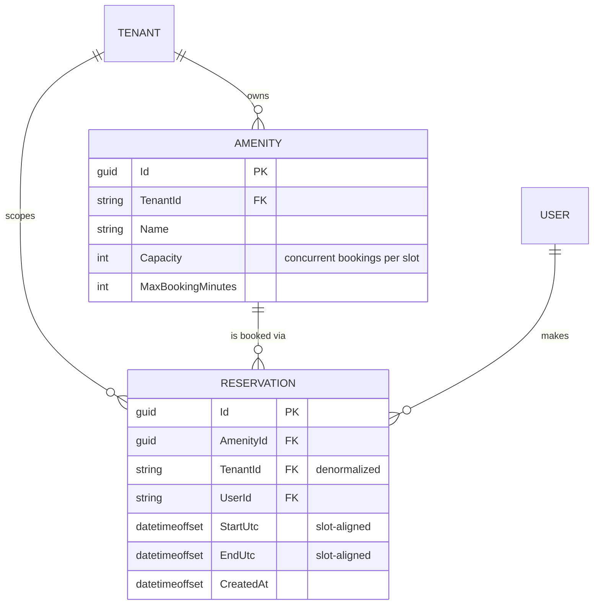

# Amenity Reservations — Design

A running slice of amenity booking for a multi-tenant property-management platform. .NET 9 minimal
API over an in-memory store; React + TypeScript through the orval-generated client.

**Built:** per-slot capacity with an amenity-keyed lock, validation, cancellation, tenant-scoped
endpoints, and a React screen with an availability grid, building switcher and simulated-user
switcher. 27 tests (`dotnet test backend/Api.Tests`).
**Designed only:** EF Core + Postgres RLS (§4) and the production concurrency mechanism (§3) — the
brief asks for in-memory persistence. **Not built:** real authentication.

---

## 1. Assumptions, and what I cut

| # | Assumption | Why |
| --- | --- | --- |
| A1 | Auth is mocked: `X-Tenant-Id` / `X-User-Id` headers. | No identity provider in the scaffold. |
| A2 | Time is discretized into **30-minute slots**. | Makes the capacity check exact (§3). 30 rather than 60 so the gym's seeded 90-minute max stays expressible. |
| A3 | All times UTC (`DateTimeOffset`), displayed as UTC. | Naive local times eventually book the wrong hour. A local grid would misalign 30-minute boundaries in `:45`-offset zones. |
| A4 | "Active" booking means `EndUtc > now`. | Needed to make the one-per-resident rule enforceable. A guess, not a requirement. |
| A5 | Cancel is a hard delete. | A `Cancelled` status means every capacity query must remember to exclude it; the one that forgets silently blocks real bookings. Production wants the status plus an audit trail. |

> `X-Tenant-Id` is **client-controlled and provides no security whatsoever** — anyone can set it and
> read another building's data. It demonstrates isolation; it does not enforce it. §4 is what
> enforcing it looks like.

**Questions for a PM.** (1) Can a resident hold two bookings for the *same* amenity — and does
"active" mean not-yet-ended or not-yet-started? (2) Opening hours: per amenity, per day? Guest
parking is plausibly 24/7 while the party room isn't. (3) Is there a cancellation cutoff, and does it
imply a fee? (4) Do managers get override powers — book for a resident, cancel anyone's, block for
maintenance? (5) Does gym "capacity 2" mean two people or two reservations, each possibly a
household?

**Deliberately out of scope.** Opening hours and blackout dates (pure validation surface — adds
schema and UI without touching the concurrency crux). Recurring bookings (expansion, exceptions,
"edit this or all future" — its own project). Payments. Notifications. Waitlists (only meaningful
once capacity is reliably enforced). Manager overrides (needs a role model; the dropdown's Manager is
currently just a third resident). Real persistence — the brief says not to.

---

## 2. Data model

`TENANT` and `USER` are logical only — opaque string ids from headers, with no rows behind them yet.

**Constraints.** Start/end align to 30-minute boundaries; `End > Start`; `Start >= now`; duration
`<= MaxBookingMinutes`; per covered slot the count of covering reservations `<= Capacity`; at most
one active reservation per `(AmenityId, UserId)`.

**Why `TenantId` is denormalized onto `Reservation`.** It's derivable via `AmenityId`, so storing it
twice invites drift. I do it anyway because **authorization shouldn't need a join**: `DELETE
/api/reservations/{id}` must prove the caller's tenant owns the row, and a join you can forget is a
security surface where a column you can't forget isn't. Postgres RLS and tenant-leading indexes (§4)
also require the column on the table. Drift is prevented by never accepting `TenantId` from the
client — it's written from the resolved context.

---

## 3. Preventing double-booking

**The failure mode.** Two residents request the gym for 09:00–10:00 simultaneously. Both handlers
read the list, both see capacity remaining, both append. Capacity 2 now holds 3. A **TOCTOU race**:
the check and the write aren't atomic, so any rule enforced by reading first loses to an interleaving
write. Kestrel serves on thread-pool threads, so this is reachable, not theoretical.

**First, the check itself has to be right.** The natural rule — count bookings overlapping the
request, reject at capacity — is **wrong when capacity > 1**. Gym, capacity 2, with `09:00–10:00` and
`10:00–11:00` booked: a request for `09:30–10:30` overlaps both, counts 2, and is refused. But
occupancy never exceeds 2 (09:30–10:00 holds two, 10:00–10:30 holds two). Bookings overlapping *the
request* needn't overlap *each other*, so the count overestimates peak concurrency. Slot alignment
fixes this: count per 30-minute slot, where every covering booking is concurrent for the whole slot,
so the count *is* the peak. This is the main reason time is discretized.

**Chosen mechanism: an amenity-keyed lock** (`ConcurrentDictionary<Guid, object>`) wrapping
check-and-insert as one atomic step. A thread-safe collection alone is not enough — it makes each
operation safe while leaving the *sequence* interleavable, which is precisely the bug. Keyed per
amenity because conflicts never cross amenities, so booking the gym shouldn't serialize behind guest
parking. Ordering matters: the amenity is validated *before* the gate is created (otherwise random
GUIDs grow the dictionary unboundedly), and the duplicate-resident check sits *inside* the lock —
it's a read-then-write that races identically, despite reading like validation.

**Two honest limits.** The lock is per-process — two API instances and it protects nothing. And
`lock` cannot hold across an `await`, so adding persistence doesn't extend this mechanism, it
**deletes** it.

**Rejected alternative: optimistic concurrency with retry.** A version counter, a compare-and-swap,
a retry loop and a retry budget — strictly more machinery, in exchange for not holding a lock during
a write that appends to an in-memory dictionary in nanoseconds. Right tool for low contention across
processes; wrong trade here.

**Production answer: let the database refuse.** Materialize slots with
`UNIQUE (amenity_id, slot_start, seat_index)`, `seat_index ∈ 0..capacity-1`. The (capacity+1)-th
concurrent booking violates the constraint and aborts — correct across any number of instances, no
distributed coordination. On Redis: Redlock is unsound for *correctness* (lock and data in separate
systems; a stalled holder still writes). Redis is sound as the **atomic arbiter** — a Lua script that
checks and increments slot counters in one step — but async replication can lose acknowledged writes,
so it belongs in front of the constraint, not instead of it.

---

## 4. Multi-tenancy

The question isn't which entities carry `TenantId` — it's **where the check lives**. Per-handler
`.Where(x => x.TenantId == ...)` leaks the first time someone forgets one, and nothing in review
makes the omission visible.

**This slice.** `TenantContext` binds from headers via a `BindAsync` hook that returns null when the
header is absent, so ASP.NET rejects with 400 *before the handler runs*. The store exposes **only
tenant-scoped accessors** — there is no unscoped `store.Amenities` to reach for. Forgetting the
filter isn't a mistake you can make.

**Production, in layers.** (1) *Application* — EF Core global query filters
(`HasQueryFilter(r => r.TenantId == CurrentTenantId)`) fed by the same middleware. Convenience, not a
boundary: `IgnoreQueryFilters()` and raw SQL bypass it. (2) *Infrastructure* — Postgres row-level
security, `CREATE POLICY tenant_isolation_policy ON reservations USING (tenant_id =
current_setting('app.current_tenant_id'))`, with a `DbConnectionInterceptor` issuing `SET LOCAL`
inside the transaction so a pooled connection can't leak one request's tenant into the next. This
holds even if the application is compromised or bypassed. (3) *Roles* — `app_tenant_user` (subject to
RLS) for the API, `app_admin_worker` (`BYPASSRLS`) for reporting and ETL. Cross-tenant reads are a
real need; the answer is a separate role the API never connects as, not a weaker policy.

**403 vs 404.** Another tenant's resource returns **404** — a 403 confirms it exists, and existence
is tenant-leaking. Within your own building, another resident's booking returns **403**, because the
reservation list already shows co-residents legitimately. Tenancy checks therefore run first.

---

## 5. API surface

All endpoints require `X-Tenant-Id`; mutations also use `X-User-Id`. Identity is a header rather than
a body field so it travels the path a verified token claim will — equally insecure today, but the
shape is what makes the swap contained.

| Method | Path | Body | Success | Errors |
| --- | --- | --- | --- | --- |
| `GET` | `/api/amenities` | — | `200 Amenity[]` | `400` no tenant |
| `GET` | `/api/amenities/{amenityId}/reservations` | — | `200 Reservation[]` | `404` |
| `POST` | `/api/amenities/{amenityId}/reservations` | `{ startUtc, endUtc }` | `201 Reservation` | `400`, `404`, `409` |
| `DELETE` | `/api/reservations/{id}` | — | `204` | `403`, `404` |

`409` = a covered slot is at capacity. `400` = misaligned, inverted, past, over-length, or the
resident already holds an active booking. Errors are RFC 7807 with a machine-readable `code`, so the
UI branches on the reason rather than string-matching. The service returns a result enum and the
endpoint maps it — status codes are a transport concern.

---

## 6. Verification

Built test-first; both central claims in §3 were **observed failing before being fixed**. The naive
capacity rule refused the legal `09:30–10:30` booking (`Expected: None, Actual: CapacityExceeded`).
Before the lock, 8 threads rushing one slot on a capacity-2 amenity all succeeded (`Expected: 2,
Actual: 8`).

**Worth recording:** that concurrency test initially *passed* without the lock — the critical section
is shorter than thread wake-up jitter, so a single rush almost never interleaves. Only repetition
(500 trials × 8 racers) made it fail reliably. A one-shot version would have read as proof of the
most important claim here while proving nothing.

The endpoint tests went compile-error → green without a behavioural red, so I mutation-checked them:
breaking the 409 mapping and breaking tenant scoping each failed exactly the right test. Running the
UI in a browser then caught two things no test would have — the reservation list spanned days while
showing only times, and past slots rendered as bookable.

**Known gap:** `frontend/src/slots.ts` reimplements the occupancy rule to draw the grid and has no
tests. The server stays authoritative, so a drifted client can only mis-*draw*, never overbook — but
the failure is silent. Better fix: have the API return computed per-slot availability.
