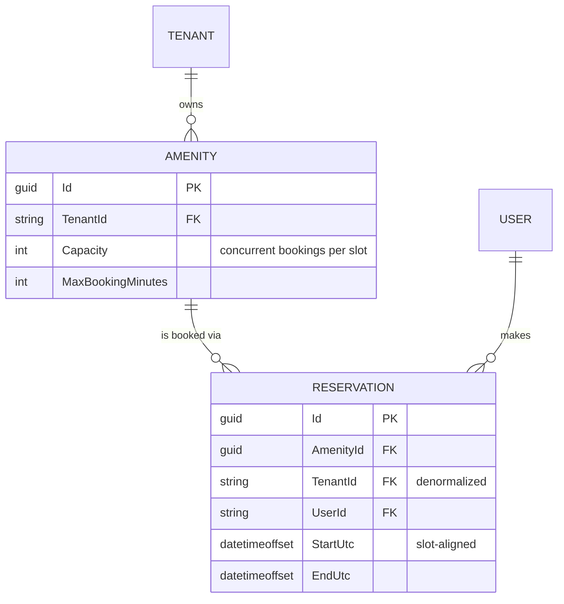

# Amenity Reservations — Design

A running slice: .NET 9 minimal API over an in-memory store, React + TypeScript through the
orval-generated client.

**Built** — per-slot capacity with an amenity-keyed lock, validation, cancellation, tenant-scoped
endpoints, and a screen with an availability grid plus building/user switchers. 27 tests.
**Designed only** — EF Core + Postgres RLS (§4) and the production concurrency mechanism (§3).
**Not built** — real authentication.

---

## 1. Assumptions, and what I cut

| # | Assumption | Why |
| --- | --- | --- |
| A1 | Auth is mocked: `X-Tenant-Id` / `X-User-Id` headers. | No identity provider in the scaffold. |
| A2 | Time is discretized into **30-minute slots**. | Makes the capacity check exact (§3). 30 not 60, so the gym's seeded 90-minute max stays expressible. |
| A3 | All times UTC, displayed as UTC. | Naive local times eventually book the wrong hour; a local grid misaligns 30-minute boundaries in `:45`-offset zones. |
| A4 | "Active" means `EndUtc > now`. | Needed to make the one-booking-per-resident rule enforceable. A guess, not a requirement. |
| A5 | Cancel is a hard delete. | A `Cancelled` status means every capacity query must exclude it, and the one that forgets silently blocks real bookings. Production wants the status plus an audit trail. |

> `X-Tenant-Id` is **client-controlled and carries no security whatsoever** — anyone can set it and
> read another building's data. It demonstrates isolation; it does not enforce it. §4 is enforcement.

**Questions for a PM.** Can a resident hold two bookings for the same amenity, and does "active" mean
not-yet-ended or not-yet-started? Are opening hours per amenity and per day — guest parking is
plausibly 24/7 while the party room isn't? Is there a cancellation cutoff, and does it imply a fee?
Do managers get overrides — book for a resident, cancel anyone's, block for maintenance?

**Deliberately out of scope.** Opening hours (validation surface only — adds schema and UI without
touching the crux). Recurring bookings (expansion, exceptions, "edit this or all future" — its own
project). Payments, notifications, waitlists. Manager overrides (needs a role model). Real
persistence — the brief says not to.

---

## 2. Data model



`TENANT` and `USER` are logical only — opaque ids from headers, no rows behind them yet.

**Constraints.** Start/end align to 30-minute boundaries; `End > Start`; `Start >= now`; duration
`<= MaxBookingMinutes`; per covered slot, covering reservations `<= Capacity`; at most one active
reservation per `(AmenityId, UserId)`.

**Why `TenantId` is denormalized onto `Reservation`.** It's derivable via `AmenityId`, so storing it
twice invites drift. Worth it because **authorization shouldn't need a join**: `DELETE
/api/reservations/{id}` must prove the caller's tenant owns the row, and a join you can forget is a
security surface where a column you can't forget isn't. RLS (§4) also requires it on the table.
Drift is prevented by never accepting `TenantId` from the client.

---

## 3. Preventing double-booking

**The failure mode.** Two residents request the gym for 09:00–10:00 at once. Both read the list, both
see room, both append. Capacity 2 holds 3. A **TOCTOU race** — check and write aren't atomic, so any
rule enforced by reading first loses to an interleaving write. Kestrel serves on thread-pool threads,
so this is reachable, not theoretical.

**The check itself has to be right first.** Counting bookings that overlap the request is **wrong
when capacity > 1**. Gym at capacity 2 with `09:00–10:00` and `10:00–11:00` booked: `09:30–10:30`
overlaps both, counts 2, refused — yet occupancy never exceeds 2. Bookings overlapping *the request*
needn't overlap *each other*, so the count overestimates peak concurrency. Counting **per 30-minute
slot** makes it exact, since within a slot every covering booking is concurrent throughout. This is
the main reason time is discretized.

### Worked example: three residents, one slot

Gym, **capacity 2**. Residents A, B and C all POST `09:00–10:00` at the same instant.

**In the prototype — an amenity-keyed lock makes check-and-insert atomic.**

```
cheap validation (alignment, past, length)      outside the gate; all three pass
gate = _amenityGates.GetOrAdd(gymId)            same object for all three

lock(gate)  A   slots 09:00,09:30 hold 0  →  0 < 2  →  INSERT  →  release
lock(gate)  B   slots 09:00,09:30 hold 1  →  1 < 2  →  INSERT  →  release
lock(gate)  C   slots 09:00,09:30 hold 2  →  2 ≥ 2  →  409, no write

store: 2 reservations
```

B and C block at the gate while A holds it, so neither can read a count that a pending write is
about to invalidate. That is the whole mechanism: **correctness comes from serializing the
check-and-write**, which is also its limit — it only works while every writer is in one process.

Keyed per amenity, since conflicts never cross amenities. Two ordering details: the amenity is
validated *before* the gate is created (else random GUIDs grow the dictionary unboundedly), and the
duplicate-resident check sits *inside* the lock — a read-then-write that races identically, despite
reading like validation.

**In production — the database refuses the write.** A booking claims the lowest free `seat_index` for
each slot it covers, one row per slot, in a single transaction:

```
Same three requests, now spread across three API instances. No shared lock exists.

A  BEGIN  lowest free seat = 0
          INSERT (gym, 09:00, seat 0), (gym, 09:30, seat 0)   COMMIT   201
B  BEGIN  lowest free seat = 1
          INSERT (gym, 09:00, seat 1), (gym, 09:30, seat 1)   COMMIT   201
C  BEGIN  read was stale — also computed seat 1
          INSERT (gym, 09:00, seat 1)  →  UNIQUE VIOLATION    ROLLBACK 409
```

**The difference that matters: C's read being wrong doesn't matter.** Correctness no longer depends
on reading fresh state, because the *write itself* is what's checked — so it holds across any number
of instances with no coordination between them. A 90-minute booking inserts three rows in one
transaction, so it's all-or-nothing; the in-memory version gets that for free only because a
reservation is a single dictionary entry.

**Two limits of the prototype, stated plainly.** The lock is per-process — two API instances and it
protects nothing. And `lock` can't hold across an `await`, so adding persistence doesn't *extend*
this mechanism, it **deletes** it. The lock is scaffolding, not a first step toward the production
design.

**Rejected alternative: optimistic concurrency with retry.** A version counter, compare-and-swap,
retry loop and retry budget: strictly more machinery, in exchange for not holding a lock during a
write that appends to a dictionary in nanoseconds. Right tool for low contention across processes;
wrong trade here.

### Redis: considered, not needed here

**Not for this.** The unique constraint already provides the guarantee, across any number of
instances, with one datastore to operate. Redis would add a second system, a dual-write hazard
(accepted in Redis, then the Postgres insert fails — capacity leaks until the TTL expires), and a
durability gap (async replication can lose acknowledged writes, and a lost counter *is* an
overbooking, which is why the constraint has to stay underneath regardless). All to buy latency this
workload doesn't need: one building generates a few hundred bookings a day with essentially no
simultaneous contention on a single slot.

**What would change my mind:** sustained contention on individual slots — a portfolio-wide
reservation drop (pool bookings opening at 9am), or ticketed events. Then Redis goes *in front* of
the constraint as a fast rejection path, implemented as an atomic Lua check-and-increment over slot
counters — never Redlock. A lock held in one system while the data lives in another isn't sound: a
process stalled past its lease expiry still holds a live database handle and writes anyway.

---

## 4. Multi-tenancy

The question isn't which entities carry `TenantId` — it's **where the check lives**. Per-handler
`.Where(x => x.TenantId == ...)` leaks the first time someone forgets one, and review won't catch
the omission.

**This slice.** `TenantContext` binds from headers via a `BindAsync` hook returning null when the
header is absent, so ASP.NET rejects with 400 *before the handler runs*. The store exposes **only
tenant-scoped accessors** — no unscoped `store.Amenities` exists to reach for, so forgetting the
filter isn't a mistake you can make.

**Production, in layers.** *Application* — EF Core global query filters
(`HasQueryFilter(r => r.TenantId == CurrentTenantId)`); a convenience, not a boundary, since
`IgnoreQueryFilters()` and raw SQL bypass it. *Infrastructure* — Postgres RLS
(`CREATE POLICY … USING (tenant_id = current_setting('app.current_tenant_id'))`) with a
`DbConnectionInterceptor` issuing `SET LOCAL` inside the transaction, so a pooled connection can't
leak one request's tenant into the next; this holds even if the app is compromised. *Roles* —
`app_tenant_user` (subject to RLS) for the API, `app_admin_worker` (`BYPASSRLS`) for reporting.
Cross-tenant reads are a real need; the answer is a role the API never connects as, not a weaker
policy.

**403 vs 404.** Another tenant's resource returns **404** — a 403 confirms existence, and existence
is tenant-leaking. Within your own building, another resident's booking returns **403**, since the
reservation list already shows co-residents. Tenancy checks therefore run before ownership checks.

---

## 5. API surface

All endpoints require `X-Tenant-Id`; mutations also use `X-User-Id`. Identity travels as a header
rather than a body field so it takes the path a verified token claim will — equally insecure today,
but the shape is what keeps the swap contained.

| Method | Path | Body | Success | Errors |
| --- | --- | --- | --- | --- |
| `GET` | `/api/amenities` | — | `200 Amenity[]` | `400` |
| `GET` | `/api/amenities/{amenityId}/reservations` | — | `200 Reservation[]` | `404` |
| `POST` | `/api/amenities/{amenityId}/reservations` | `{ startUtc, endUtc }` | `201 Reservation` | `400`, `404`, `409` |
| `DELETE` | `/api/reservations/{id}` | — | `204` | `403`, `404` |

`409` = a covered slot is at capacity. `400` = misaligned, inverted, past, over-length, or the
resident already holds an active booking. Errors are RFC 7807 with a machine-readable `code` so the
UI branches on the reason rather than string-matching. The service returns a result enum and the
endpoint maps it — status codes are a transport concern.

---

## 6. Verification

27 tests. Both claims in §3 were **observed failing before being fixed** — the naive capacity rule
refused the legal `09:30–10:30` booking, and before the lock, 8 threads rushing one slot on a
capacity-2 amenity *all* succeeded. The concurrency test initially passed without the lock and only
failed reliably once repeated 500×; details in the PR description.

**Known gap:** `frontend/src/slots.ts` reimplements the occupancy rule to draw the grid and has no
tests. A drifted client can only mis-*draw*, never overbook — but the failure is silent.
