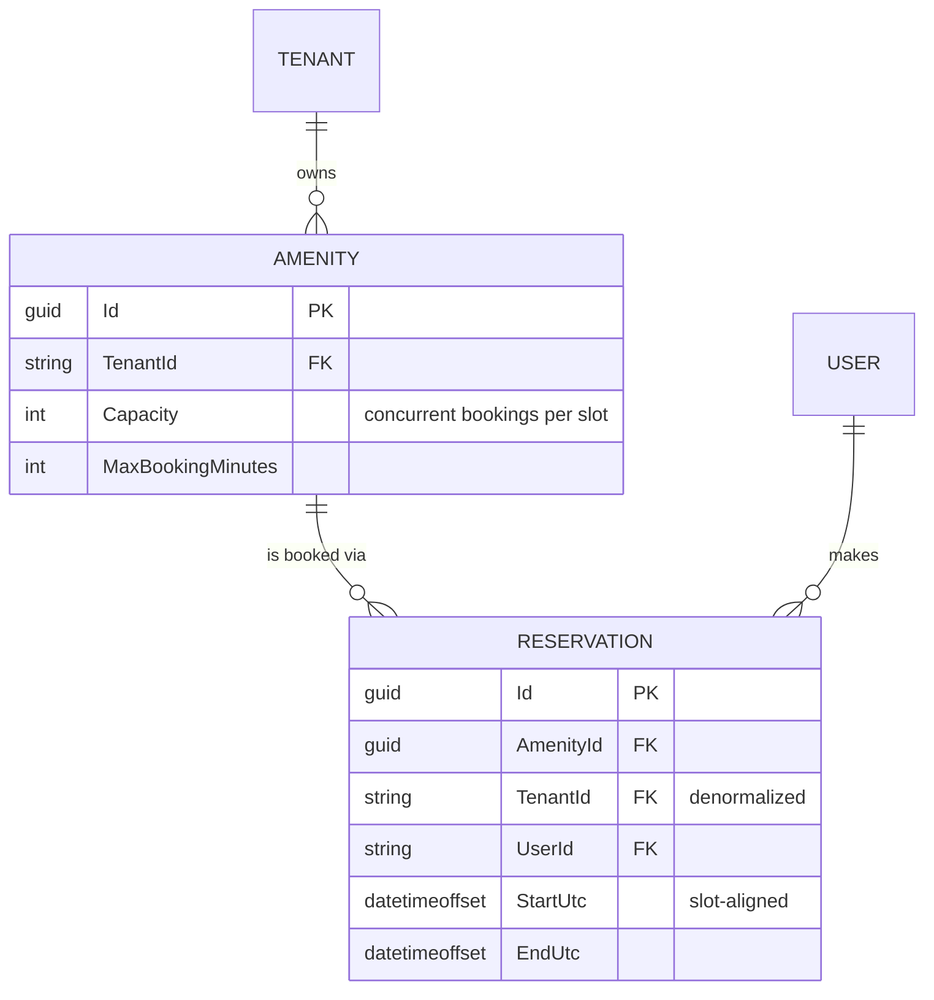

# Amenity Reservations — Design

A running slice: .NET 9 minimal API over an in-memory store, React + TypeScript through the
orval-generated client.

**Built** — per-slot capacity with an amenity-keyed lock, validation, cancellation, tenant-scoped
endpoints, and a screen with an availability grid plus building/user switchers. 27 tests.
**Designed only** — EF Core + Postgres RLS (§4) and the production concurrency mechanism (§3).
**Not built** — real authentication.

---

## 1. Assumptions, and what I cut

| # | Assumption | Why |
| --- | --- | --- |
| A1 | Auth is mocked: `X-Tenant-Id` / `X-User-Id` headers. | No identity provider in the scaffold. |
| A2 | Time is discretized into **30-minute slots**. | Makes the capacity check exact (§3). 30 not 60, so the gym's seeded 90-minute max stays expressible. |
| A3 | All times UTC, displayed as UTC. | Naive local times eventually book the wrong hour; a local grid misaligns 30-minute boundaries in `:45`-offset zones. |
| A4 | "Active" means `EndUtc > now`. | Needed to make the one-booking-per-resident rule enforceable. A guess, not a requirement. |
| A5 | Cancel is a hard delete. | A `Cancelled` status means every capacity query must exclude it, and the one that forgets silently blocks real bookings. Production wants the status plus an audit trail. |

> `X-Tenant-Id` is **client-controlled and carries no security whatsoever** — anyone can set it and
> read another building's data. It demonstrates isolation; it does not enforce it. §4 is enforcement.

**Questions for a PM.** Can a resident hold two bookings for the same amenity, and does "active" mean
not-yet-ended or not-yet-started? Are opening hours per amenity and per day — guest parking is
plausibly 24/7 while the party room isn't? Is there a cancellation cutoff, and does it imply a fee?
Do managers get overrides — book for a resident, cancel anyone's, block for maintenance?

**Deliberately out of scope.** Opening hours (validation surface only — adds schema and UI without
touching the crux). Recurring bookings (expansion, exceptions, "edit this or all future" — its own
project). Payments, notifications, waitlists. Manager overrides (needs a role model). Real
persistence — the brief says not to.

---

## 2. Data model



`TENANT` and `USER` are logical only — opaque ids from headers, no rows behind them yet.

**Constraints.** Start/end align to 30-minute boundaries; `End > Start`; `Start >= now`; duration
`<= MaxBookingMinutes`; per covered slot, covering reservations `<= Capacity`; at most one active
reservation per `(AmenityId, UserId)`.

**Why `TenantId` is denormalized onto `Reservation`.** It's derivable via `AmenityId`, so storing it
twice invites drift. Worth it because **authorization shouldn't need a join**: `DELETE
/api/reservations/{id}` must prove the caller's tenant owns the row, and a join you can forget is a
security surface where a column you can't forget isn't. RLS (§4) also requires it on the table.
Drift is prevented by never accepting `TenantId` from the client.

---

## 3. Preventing double-booking

Two problems hide under this heading. They are independent, and both have to be solved:

| | Problem | Symptom if unsolved |
| --- | --- | --- |
| **A** | **What to count** — is the capacity rule itself correct? | A legal request is wrongly refused, even with no concurrency at all |
| **B** | **When to count** — are the check and the write atomic? | Concurrent requests each see room and overbook the slot |

A is a logic bug, B is a race. Fixing one does nothing for the other.

### Problem A — what to count

The natural rule is *count the bookings that overlap this request; reject at capacity*. It is **wrong
whenever capacity > 1**. Gym, capacity 2:

```
existing    09:00 ──────── 10:00
existing                   10:00 ──────── 11:00
requested         09:30 ────────── 10:30       overlaps both → count 2 → REFUSED
```

But occupancy never exceeds 2 — from 09:30–10:00 the room holds two bookings, from 10:00–10:30 it
holds two. The request is legal and we refused it. The flaw: bookings overlapping *the request* need
not overlap *each other*, so a flat count overestimates peak concurrency.

**Fix: count per 30-minute slot, not per request.** Within one slot, every booking covering it is
concurrent for that slot's whole duration, so the count *is* the peak concurrency and the check
becomes exact. This is the main reason time is discretized (A2).

### Problem B — when to count: the race

Two residents request the gym for 09:00–10:00 at the same instant. Both read the list, both see room,
both append. Capacity 2 now holds 3. A **TOCTOU race** — the check and the write are separate steps,
so any rule enforced by reading first loses to an interleaving write. Kestrel serves on thread-pool
threads, so this is reachable, not theoretical.

The rest of this section is about B. Below, gym at capacity 2, residents **A, B and C all POST
`09:00–10:00` simultaneously**.

### Solving B in the prototype: an amenity-keyed lock

```
cheap validation (alignment, past, length)      outside the gate; all three pass
gate = _amenityGates.GetOrAdd(gymId)            same object for all three

lock(gate)  A   slots 09:00,09:30 hold 0  →  0 < 2  →  INSERT  →  release
lock(gate)  B   slots 09:00,09:30 hold 1  →  1 < 2  →  INSERT  →  release
lock(gate)  C   slots 09:00,09:30 hold 2  →  2 ≥ 2  →  409, no write

store: 2 reservations
```

B and C block at the gate while A holds it, so neither can read a count that a pending write is about
to invalidate. **Correctness comes from serializing check-and-write** — which is also the limit: it
holds only while every writer is inside one process.

Two details easy to get wrong: the amenity is validated *before* the gate is created (else anyone
grows the dictionary by posting random GUIDs), and the duplicate-resident check sits *inside* the
lock — it reads like validation, but it's a read-then-write that races identically.

**Why this doesn't survive contact with production.** The lock is per-process, so two API instances
and it protects nothing. And `lock` cannot hold across an `await`, so adding a database doesn't
*extend* this mechanism — it **deletes** it. The lock is scaffolding, not step one.

### Solving B in production: the database refuses the write

Materialize the slots a booking occupies, one row each, with
`UNIQUE (amenity_id, slot_start, seat_index)` where `seat_index ∈ 0..capacity-1`. A booking claims
the lowest free seat per slot, in one transaction:

```
Same three requests, now spread across three API instances. No shared lock exists.

A  BEGIN  lowest free seat = 0
          INSERT (gym, 09:00, seat 0), (gym, 09:30, seat 0)   COMMIT   201
B  BEGIN  lowest free seat = 1
          INSERT (gym, 09:00, seat 1), (gym, 09:30, seat 1)   COMMIT   201
C  BEGIN  read was stale — also computed seat 1
          INSERT (gym, 09:00, seat 1)  →  UNIQUE VIOLATION    ROLLBACK 409
```

**The key difference: C's read being wrong doesn't matter.** Correctness no longer depends on reading
fresh state, because the *write* is what gets checked — so it holds across any number of instances
with no coordination between them. The transaction also makes a multi-slot booking all-or-nothing.

### Rejected alternative: optimistic concurrency with retry

A version counter, compare-and-swap, retry loop and retry budget — more machinery, in exchange for
not holding a lock during a write that appends to a dictionary in nanoseconds. The right tool for low
contention across process boundaries; here it buys nothing and adds three places for a bug.

### Redis: considered, not needed here

**Not for this.** The unique constraint already provides the guarantee, across any number of
instances, with one datastore to operate. Redis would add a second system, a dual-write hazard
(accepted in Redis, then the Postgres insert fails — capacity leaks until the TTL expires), and a
durability gap (async replication can lose acknowledged writes, and a lost counter *is* an
overbooking, which is why the constraint has to stay underneath regardless). All to buy latency this
workload doesn't need: one building generates a few hundred bookings a day with essentially no
simultaneous contention on a single slot.

**What would change my mind:** sustained contention on individual slots — a portfolio-wide
reservation drop (pool bookings opening at 9am), or ticketed events. Then Redis goes *in front* of
the constraint as a fast rejection path, implemented as an atomic Lua check-and-increment over slot
counters — never Redlock. A lock held in one system while the data lives in another isn't sound: a
process stalled past its lease expiry still holds a live database handle and writes anyway.

---

## 4. Multi-tenancy

**The rule.** Every amenity and every reservation carries a `TenantId`. Every read and write is
scoped to the caller's building, and `TenantId` is never accepted from the client — it always comes
from the resolved request context, so it cannot be spoofed by a request body.

**The design question is where that scoping is enforced.** If each handler writes its own
`.Where(x => x.TenantId == ...)`, isolation holds exactly as long as nobody forgets one — and a
missing filter looks identical to correct code in review.

**In this slice**, two mechanisms, neither of which a handler can opt out of:

- `TenantContext` binds from `X-Tenant-Id` via a `BindAsync` hook that returns null when the header
  is missing, so ASP.NET rejects with `400` *before the handler body runs*.
- The store exposes **only** scoped accessors — `AmenitiesFor(tenantId)`, `ReservationsFor(tenantId,
  amenityId)`. There is no unscoped `store.Amenities` to reach for, so forgetting the filter is not a
  mistake that's available to make.

**In production, three layers**, each catching what the one above it misses:

| Layer | Mechanism | Catches | Limit |
| --- | --- | --- | --- |
| Application | EF Core global query filters | Developer error; every LINQ query is filtered automatically | `IgnoreQueryFilters()` and raw SQL bypass it |
| Database | Postgres RLS policy + `SET LOCAL app.current_tenant_id` from a connection interceptor | Everything above it misses — holds against a compromised app or ad-hoc `psql` | Needs `tenant_id` on the table (§2) |
| Credentials | `app_tenant_user` (subject to RLS) for the API; `app_admin_worker` (`BYPASSRLS`) for reporting | Reporting's real cross-tenant need, without weakening the policy | — |

They aren't redundant: the query filter prevents accidents, RLS *is* the boundary, and the role split
means the credentials the API holds cannot bypass RLS even if the app is owned. `SET LOCAL` scopes
the setting to the transaction, so a pooled connection can't leak one request's tenant into the next
— the easiest detail here to get wrong.

**403 vs 404.** Another building's resource returns **404**, never 403: a 403 confirms the row
exists, and existence is itself tenant-leaking. Within your own building, another resident's booking
returns **403**, since the reservation list already shows co-residents. So tenancy is always checked
before ownership.

## 5. API surface

All endpoints require `X-Tenant-Id`; mutations also use `X-User-Id`. Identity travels as a header
rather than a body field so it takes the path a verified token claim will — equally insecure today,
but the shape is what keeps the swap contained.

| Method | Path | Body | Success | Errors |
| --- | --- | --- | --- | --- |
| `GET` | `/api/amenities` | — | `200 Amenity[]` | `400` |
| `GET` | `/api/amenities/{amenityId}/reservations` | — | `200 Reservation[]` | `404` |
| `POST` | `/api/amenities/{amenityId}/reservations` | `{ startUtc, endUtc }` | `201 Reservation` | `400`, `404`, `409` |
| `DELETE` | `/api/reservations/{id}` | — | `204` | `403`, `404` |

`409` = a covered slot is at capacity. `400` = misaligned, inverted, past, over-length, or the
resident already holds an active booking. Errors are RFC 7807 with a machine-readable `code` so the
UI branches on the reason rather than string-matching. The service returns a result enum and the
endpoint maps it — status codes are a transport concern.

---

## 6. Verification

27 tests. Both claims in §3 were **observed failing before being fixed** — the naive capacity rule
refused the legal `09:30–10:30` booking, and before the lock, 8 threads rushing one slot on a
capacity-2 amenity *all* succeeded. The concurrency test initially passed without the lock and only
failed reliably once repeated 500×; details in the PR description.

**Known gap:** `frontend/src/slots.ts` reimplements the occupancy rule to draw the grid and has no
tests. A drifted client can only mis-*draw*, never overbook — but the failure is silent.
